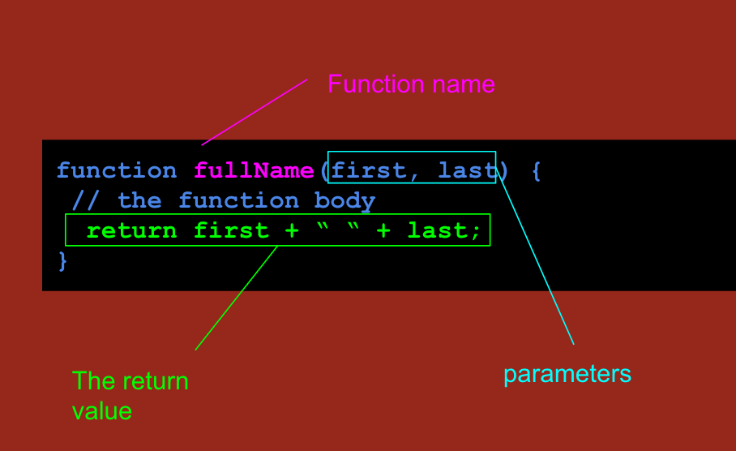

# JS Dive
## Strings to Functions

<!-- toc -->

- [How To Play](#how-to-play)
  * [In Your Browser](#in-your-browser)
  * [Using A Web App](#using-a-web-app)
  * [Others](#others)
- [Level 1 - String Manipulation](#level-1---string-manipulation)
  * [Variables](#variables)
  * [Exercises](#exercises)
  * [String Methods](#string-methods)
  * [Exercises](#exercises-1)
- [Level 2 - Array Manipulation](#level-2---array-manipulation)
  * [Array Basics](#array-basics)
  * [Exercises](#exercises-2)
  * [Array Methods](#array-methods)
  * [Exercises](#exercises-3)
- [Level 3 - Function Basics](#level-3---function-basics)
  * [Using Functions](#using-functions)
  * [Function Parts](#function-parts)
- [Level 4 - Write Functions](#level-4---write-functions)
- [Exercises](#exercises-4)
- [Level 5 - Conditionals and Loops](#level-5---conditionals-and-loops)
  * [Looping](#looping)

<!-- tocstop -->

## How To Play

### In Your Browser

Open up your JavaScript console to play in your Chrome Browser.

```
View > Developer > JavaScript Console
```

The console is a place where you can write and play with JavaScript.

### Using A Web App

[Repl.it](https://repl.it/languages/javascript) has a JavaScript environment you can use to play with JavaScript.


### Others

[Codepen.io](https://codepen.io/pen) allows you to write a simple web page quickly.

## Level 1 - String Manipulation

* Use a variable to hold string values
* Discuss and use a few String methods
* Problem solve with strings

### Variables

A variable is way to store a value. You do this by giving a name to the value.

```javascript
var userName = "Jane Doe";

userName
// => "Jane Doe"

"Hello, my name is " + userName;
// => "Hello, my name is Jane Doe"
```

**Why?**

* Using a name for a variable clarifies its purpose

  ```javascript
  // I know that "Jane Doe" is the user's name
  var userName = "Jane Doe";
  ```

* Makes it's usage in other code more readable

  ```javascript
  // Here I am using the user's name to make an introduction
  "Hello, my name is " + userName;
  ```

* As you write more code using a value you can easily refer back to it.

=====

### Exercises

* Create a variable for your **first name**.
* Create a variable for your **last name**.
* Create a variable for you **full name** using the previous two variable in the "last, first" format.
* **BONUS**: using just one extra variable swap your **first** and **last** name.
  * Talk about how you'd do this with the person next to you.
  * What goes wrong if you just set your **first** name to your **last** name.

### String Methods

One of the first things you might be interested in with a string is its length.

```javascript
"Hello".length
// => 5
```

This is useful information to have about the string. It would be very useful if we had a user creating a password for a site and we wanted to make sure it was longer than six characters. The `length` is an example of a useful **property** on the string value.


A method is slightly different in that it will actually do something for you.

```javascript
"jane".startsWith("j");
// => true
"jane".startsWith("ja");
// => true

"jane".startsWith("ji");
// => false
```

> This method helps us check if a string starts with some provided letters and returns true or false. There is also an `endsWith` method.


There are other nice methods. Imagine I had a string like `"dElmEr"` which has inconsistent casing. We could use a method like the following:

```javascript
"dElmEr".toUpperCase()
// => "DELMER"

"dElmEr".toLowerCase()
// => "delmer"
```

Imagine I wrote a long sentence and wanted to break up the words.

```javascript
"I went to the store today".split(" "); // break it up on spaces
// => ["I", "went", "to", "the", "store", "today"]

var words = "I went to the store today".split(" ");
words.length
// => 6
```

Split is going to be super useful once you get comfortable with arrays.

If you wanted to you could go through each character in a String.

```javascript
var myName = "jane";

myName[0]  // Note it starts at 0
// => "j"
myName[1]
// => "a"
myName[2]
// => "n"
myName[3]
// => "e"
```

> Note how it starts at index zero and the last item is at position three not position four.
====

### Exercises

* How would you read the first character in the word `"crocodile"`.
* How would you find the last character in the word `"fountain"`.
* Use the length property of the word to find the last character in `"happy"`.
* What's the middle character of the following word:

  ```javascript
  var myWord = "supercalifragilisticexpialidocious";
  ```

* How could you break up the words in the following:

  ```javascript
  var myText = "Hello,How,Are,You";

  ```
* How could you break up the words in the following:

  ```javascript
  var myText = "Hello, How, Are, You";
  ```

* How could you break up the words in the following:

  ```javascript
  var myText = "Hello | How | Are | You";
  ```

## Level 2 - Array Manipulation

* Create an array
* Read and change values in an array
* Use specialized methods to manipulate Arrays


### Array Basics

In order to create an Array. You use square brackets as in the following:

```javascript
var myFriends = ["Jane", "Ruby", "Taylor"];
// => ["Jane", "Ruby", "Taylor"]
```

You can check how many things are in your array:

```javascript
myFriends.length
// => 3
```

Once you create it you can read out the values:

```javascript
myFriends[0]
// => "Jane"
myFriends[1]
// => "Ruby"
myFriends[2]
// => "Taylor"
```

If you're careful you can actually change values in the collection.

```javascript
myFriends[1] = "Sam";

myFriends
// => ["Jane", "Sam", "Taylor"]
```

People shy away from manipulating values in an array like this.

### Exercises


* Read out the first value from the following:

  ```javascript
  var names = ["Sam", "Taylor", "Ruby"];
  ```

* Read out the last value from the `names` array.
* Swap the first and last names in the `names` array. Hint: use a variable.
* Create an array with the eight planets of the Solar system.
* Change "Earth" to "Pale blue dot".
* Use the length to grab the last planet in the Solar system.
* Use the length of the planets to find the middle planet.

### Array Methods

Often times you want to add up to arrays of information.

```javascript
["jane", "jack"].concat(["ruby", "sam", "taylor"]);
// => ["jane", "jack", "ruby", "sam", "taylor"]
```

You also might want to quickly reverse an array.

```javascript
["alpha", "beta", "gamma"].reverse()
// => ["gamma", "beta", "alpha"]
```

You also might want to join a bunch of strings together.

```javascript
["ruby", "sam", "taylor"].join(",");
// => "ruby,sam,taylor"

["ruby", "sam", "taylor"].join(" and ");
// => "ruby and sam and taylor"


["ruby", "sam", "taylor"].join(" | ");
// => "ruby | sam | taylor"
```

The `split` string method is often used in combination with the `join` method.

```javascript
var names = "jack,jill,ruby,sam,taylor".split(",");

names
// => ["jane", "jack", "ruby", "sam", "taylor"]

var reveresedNames = names.reverse();
// => ["taylor", "sam", "ruby", "jack", "jane"]

reveresedNames.join(",")
// => "taylor,sam,ruby,jack,jane"
```

Developers might `split` and `join` multiple times to get the right format.

```javascript
var deskGroups = "jane,jack,jill | ruby,sam,taylor | pat,jo,kris".split(" | ");
// => ["jane,jack,jill", "ruby,sam,taylor", "pat,jo,kris"]

var studentList = deskGroups.join(",");
//  => "jane,jack,jill,ruby,sam,taylor,pat,jo,kris"

var studentNames = studentList.split(",");
// => ["jane", "jack", "jill", "ruby", "sam", "taylor", "pat", "jo", "kris"]
```

### Exercises

* Combine the following arrays, fancy with other:

  ```javascript
  var fancyCars = ["benz", "audi", "cadillac"];
  var otherCars = ["ford", "honda", "vw"];
  ```
* Swap `fancyCars` with `otherCars`.
* Reverse the list of `fancyCars`.
* Use `split` and `join` to reverse the word "Hello". Hint: what happens when you `.split("")`.
* Join together the following names with `"|"`:

  ```javascript
  var names = ["ruby", "sam", "taylor"];
  ```
* Use split and join to change the separator for these words to `"|"`

  ```javascript
  var nameList = "jane,jack,jill,ruby,sam,taylor,pat,jo,kris";
  ```

* Turn the following into a single array of names

  ```javascript
  var vipList = "jane|jack|jill|ruby"
  var generalAdmission = "sam,taylor,pat,jo";
  ```
* Turn the following into an array of names

  ```javascript
  var friends = "jane,jack,jill,ruby | sam,taylor,pat,jo";
  ```

## Level 3 - Function Basics

* Use functions that return values
* Identify the parts of a function
* Apply functions to simple problems.


### Using Functions

In this section we will focus on using functions.

```javascript
function fullName(first, last) {
  return [last, first].join(", ");
}
```

Copy and paste the above code into your console. That will define the function so we can use it.


```javascript
fullName("Jane", "Doe");
// => "Doe, Jane";

// You can save this to a variable for use later.
var bestFriend = fullName("Jane", "Doe");

bestFriend
// => "Doe, Jane";
```

* Try doing the above with your name

------

```javascript
function capitalize(word) {
  var letters = word.split("");
  var firstLetter = letters[0];

  letters[0] = firstLetter.toUpperCase();

  return letters.join("");
}
```

This is a function to let us capitalize words in our program.

```javascript
capitalize("delmer");
// => "Delmer"

capitalize("sam")
// => "Sam"
```

* Try the above using your name.
* What happens if you do the following?

  ```javascript
  capitalize("i went to the store.")
  ```

---

```javascript
function isOdd(num) {
  return num % 2 === 0;
}
```

* Verify that the `isOdd` return `true` for odd numbers and false otherwise.


### Function Parts

Before we can use a function it has to be defined, and it has a few parts to its definition.




You can write functions without return values. This is common when you want to do something, but aren't really looking for a return value afterword.

> When a user clicks a button to `showComments` on a FaceBook post then you'll just write code to change the webpage, but it won't return anything.

Until we get to event handling or other topics we'll just assume we need a return value.

## Level 4 - Write Functions

* Review the parts of a function
* Practice writing many small functions


## Exercises

* Write a function to return a `fullName` in all caps.
* Write a function to `swap` the first and last value in an array.
* Write a function to `removeSpaces` from a string. Hint: `split` and `join`


## Level 5 - Conditionals and Loops

* Write a conditional using `if`
* Write a `for` loop to iterate over an array.

Often times your programs will need to change their behavior based on some value.

```javascript
// Imagine we are writing some code to check if someone can drink alcohol
var age = 22;

if (age >= 21) {
  alert("You can drink!");
}
```

* Try the above in you console
* Change the age to `19` and paste it into your console.


### Looping

When using arrays of values it often necessary to work with each value in the array. This repetitive task would be quite annoying if we had to write out each step. Imagine we wanted to alert every value in an array.

```javascript
var names = ["ruby", "sam", "taylor", "jane"];

alert(names[0]);
alert(names[1]);
alert(names[2]);
alert(names[3]);
```

The other problem is what happens if I add more names?

```javascript
var names = ["ruby", "sam", "taylor", "jane"].concat(otherNames);
// uh oh, how many names do we have now?
// writing out each alert isn't quite possible
```

The real problem is we don't know how many items are in the array, the length of the array, and can't use that to do our task.

Luckily, we have loops!


```javascript
var names = ["ruby", "sam", "taylor", "jane"];

for (var index = 0; index < names.length; index = index + 1) {
  alert(names[index])
}
```

* Discuss with the person next to you how you think the loop is working.


What's going on is the following.

* an initial setup (only runs once)
* a condition for repeating
* block of code to be run for each repetition (the stuff in the curly's)
* a way to move to the next step or change

```
for (initial setup; check condition; move to next step) {
  run this code for before changing state
}
```

* Modify the following to only alert names that `startsWith` the letter `j`.


  ```javascript
  var names = ["jackie", "sam", "taylor", "jane"];

  for (var index = 0; index < names.length; index = index + 1) {
    alert(names[index])
  }
  ```
